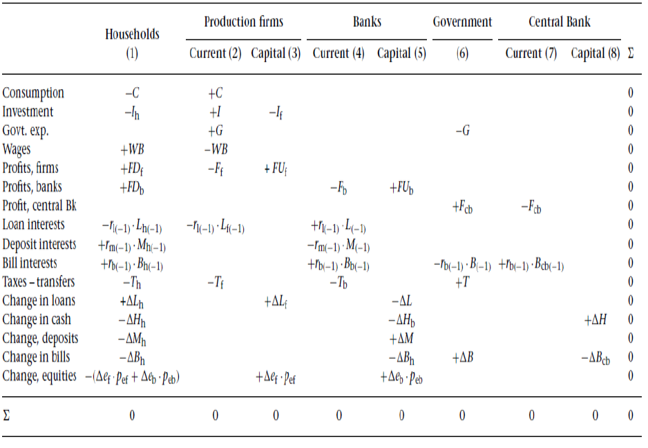
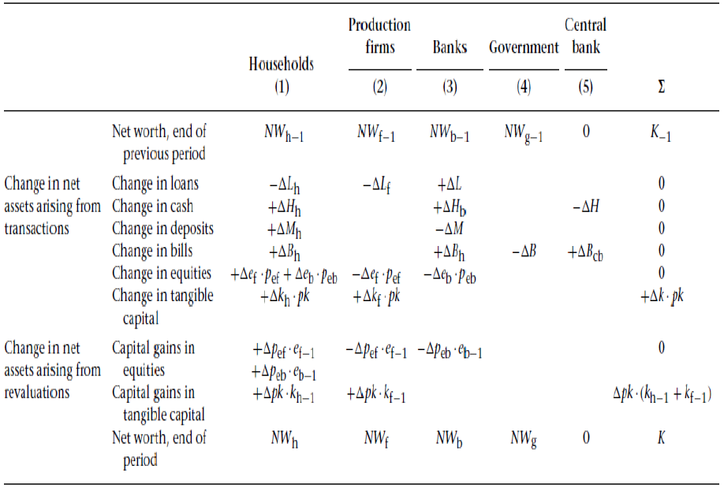

```{r setup, include=FALSE}
knitr::opts_chunk$set(echo = FALSE)
library(plotrix)
library(pdfetch)
library(networkD3)
library(knitr)
```

# Welcome!

- Welcome and thanks for taking this module
- intended for students who have a good mathematical background and wish to expand their knowledge of advanced economic modelling, data calibration, and model simulation
- On completion of the module, the students will have a deep understanding of various modelling practices in economics and their relevance in policy making, as well as an in-depth knowledge of data calibration and model simulation

# Aims

- introduce students to pluralistic modelling practices such as Stock-Flow-Consistent (SFC) modelling, Kaleckian growth models, Post-Keynesian and Marxian models of growth and debt cycles and Agent-Based Modeling (ABM)
- equip students with the necessary knowledge to build and simulate different small and medium scale models.
- equip students with an in-depth knowledge of data analysis and model simulation.
- introduce students to the basics of system dynamics approach


# Logistics

- Module leader: Antoine Godin
	* Office: HH0009
	* Office hours: Tue, Wed, Thu: 11-12
	* Email: a.godin@kingston.ac.uk
- Lecturer: Devrim Yilmaz
	* Office: HH1011
	* Office hours: Mon: 4.00-5.30 & Tue: 2.30-4.00
	* Email: s.yilmaz@kingston.ac.uk

# Outline

- Week 1-2: Understanding National Accounts
- Week 3-5: Stock-Flow Consistent Modelling
- Week 6-8: Heterodox Theories of Distribution and Growth
- Week 9-12: Growth and Debt Cycles
- Week 13-14: Modelling System Dynamics
- Week 15–16: Introduction to Agent - Based Modelling
- Week 17–22: Stock-Flow Consistent Agent Based Models

# Assessment

- Thre research projects (Nov. 16, Feb. 15 and Apr. 7), each 25%
- One class test (Jan. 11), 25%

# Week 1 to 5: SFC modelling and national accounts

- Get you fluent in ESA2010 language: what does S11, P3, MIO_NAC or EL stand for?
- Know your way around Eurostat and ONS database
- Introduction to R and relevant packages (pdfetch, PKSFC)
- Build and calibrate medium scale SFC model

# National Accounts and Stock-Flow Consistent Modelling

- SFC models are based on a set of different tables that are more or less connected to real data and national accounts.
- Balance Sheets
- Transaction Flow Matrix
- Full Integration Matrix
- References: Godley and Lavoie Ch. 2, Caverzasi and Godin (2015), Eurostat and ONS Blue book


# Stock-Flow Accounting

- Started with Copeland (1949) and his Social Accounting for moneyflows, picked up by Denizet (1969) and many others...
- Highlights the importance to incorporate monetary and financial processes into national accounts such as NIPA.
- Very close to Keynes's idea to integrate financial and income accounting.
- Idea is to be able to answer Copeland questions:
	* when total purchases of our national product increase, where does the money come from to finance them?
	* when purchases of our national product decline, what becomes of the money that is not spent?

# Balance Sheets

- Balance sheets display the assets, liabilities and the balancing item net worth.
- Most of you are familiar with basic balance sheets such as the households balance sheet for the households at the end of 2015 in the United Kingdom (source eurostat).

```{r, echo=FALSE,message=FALSE}
names<-c("F2","F3","F4","F5","F6","F7","BF90")
sec="S14_S15"
F_BS_raw = pdfetch_EUROSTAT("nasa_10_f_bs", UNIT="MIO_NAC", CO_NCO="CO", NA_ITEM=names, SECTOR=sec, TIME="2014", GEO="UK")
F_BS<-as.data.frame(F_BS_raw)
NFA_BS_raw = pdfetch_EUROSTAT("nama_10_nfa_bs", UNIT="CP_MNAC", SECTOR=sec, GEO="UK", ASSET10=c("N1N","N2N"))
NFA_BS<-as.data.frame(NFA_BS_raw)
balancesheet<-matrix(0,ncol=2,nrow=9,dimnames = list(c("Produced non-financial asset","Non-produced non financial assets","Currency and deposits","Securities other than shares","Loans","Shares and other equity","Insurance technical reserves","Other accounts receivable/payable","Net Worth"),c("Assets","Liabilities")))
counter<-1
for(name in c("N1N","N2N")){
	colnamea<-paste("A.CP_MNAC",sec,name,"UK",sep=".")
	balancesheet[counter,1]<-NFA_BS[18,colnamea]
	counter<-counter+1
}
for(name in names[1:6]){
	colnamea<-paste("A.MIO_NAC.CO",sec,"ASS",name,"UK",sep=".")
	colnamel<-paste("A.MIO_NAC.CO",sec,"LIAB",name,"UK",sep=".")
	balancesheet[counter,1]<-F_BS[20,colnamea]
	balancesheet[counter,2]<-F_BS[20,colnamel]
	counter<-counter+1
}
balancesheet[9,2]<-F_BS[20,paste("A.MIO_NAC.CO",sec,"LIAB.BF90.UK",sep=".")]+NFA_BS[18,paste("A.CP_MNAC",sec,"N1N.UK",sep=".")]+NFA_BS[18,paste("A.CP_MNAC",sec,"N2N.UK",sep=".")]
kable(balancesheet)
```


# Non-financial corporations

```{r, echo=FALSE,message=FALSE}
names<-c("F2","F3","F4","F5","F6","F7","BF90")
sec="S11"
F_BS_raw = pdfetch_EUROSTAT("nasa_10_f_bs", UNIT="MIO_NAC", CO_NCO="CO", NA_ITEM=names, SECTOR=sec, TIME="2014", GEO="UK")
F_BS<-as.data.frame(F_BS_raw)
NFA_BS_raw = pdfetch_EUROSTAT("nama_10_nfa_bs", UNIT="CP_MNAC", SECTOR=sec, GEO="UK", ASSET10=c("N1N","N2N"))
NFA_BS<-as.data.frame(NFA_BS_raw)
balancesheet<-matrix(0,ncol=2,nrow=9,dimnames = list(c("Produced non-financial asset","Non-produced non financial assets","Currency and deposits","Securities other than shares","Loans","Shares and other equity","Insurance technical reserves","Other accounts receivable/payable","Net Worth"),c("Assets","Liabilities")))
counter<-1
for(name in c("N1N","N2N")){
	colnamea<-paste("A.CP_MNAC",sec,name,"UK",sep=".")
	balancesheet[counter,1]<-NFA_BS[18,colnamea]
	counter<-counter+1
}
for(name in names[1:6]){
	colnamea<-paste("A.MIO_NAC.CO",sec,"ASS",name,"UK",sep=".")
	colnamel<-paste("A.MIO_NAC.CO",sec,"LIAB",name,"UK",sep=".")
	balancesheet[counter,1]<-F_BS[20,colnamea]
	balancesheet[counter,2]<-F_BS[20,colnamel]
	counter<-counter+1
}
balancesheet[9,2]<-F_BS[20,paste("A.MIO_NAC.CO",sec,"LIAB.BF90.UK",sep=".")]+NFA_BS[18,paste("A.CP_MNAC",sec,"N1N.UK",sep=".")]+NFA_BS[18,paste("A.CP_MNAC",sec,"N2N.UK",sep=".")]
kable(balancesheet)
```

- note negative net worth due to market value of equity
- capital stock are at market value (replacement cost) and not historical costs

# Financial corporations

```{r, echo=FALSE,message=FALSE}
names<-c("F2","F3","F4","F5","F6","F7","BF90")
sec="S12"
F_BS_raw = pdfetch_EUROSTAT("nasa_10_f_bs", UNIT="MIO_NAC", CO_NCO="CO", NA_ITEM=names, SECTOR=sec, TIME="2014", GEO="UK")
F_BS<-as.data.frame(F_BS_raw)
NFA_BS_raw = pdfetch_EUROSTAT("nama_10_nfa_bs", UNIT="CP_MNAC", SECTOR=sec, GEO="UK", ASSET10=c("N1N","N2N"))
NFA_BS<-as.data.frame(NFA_BS_raw)
balancesheet<-matrix(0,ncol=2,nrow=9,dimnames = list(c("Produced non-financial asset","Non-produced non financial assets","Currency and deposits","Securities other than shares","Loans","Shares and other equity","Insurance technical reserves","Other accounts receivable/payable","Net Worth"),c("Assets","Liabilities")))
counter<-1
for(name in c("N1N","N2N")){
	colnamea<-paste("A.CP_MNAC",sec,name,"UK",sep=".")
	balancesheet[counter,1]<-NFA_BS[18,colnamea]
	counter<-counter+1
}
for(name in names[1:6]){
	colnamea<-paste("A.MIO_NAC.CO",sec,"ASS",name,"UK",sep=".")
	colnamel<-paste("A.MIO_NAC.CO",sec,"LIAB",name,"UK",sep=".")
	balancesheet[counter,1]<-F_BS[20,colnamea]
	balancesheet[counter,2]<-F_BS[20,colnamel]
	counter<-counter+1
}
balancesheet[9,2]<-F_BS[20,paste("A.MIO_NAC.CO",sec,"LIAB.BF90.UK",sep=".")]+NFA_BS[18,paste("A.CP_MNAC",sec,"N1N.UK",sep=".")]+NFA_BS[18,paste("A.CP_MNAC",sec,"N2N.UK",sep=".")]
kable(balancesheet)
```

- Central Banks are in the financial corporations

# Goverment

```{r, echo=FALSE,message=FALSE}
names<-c("F2","F3","F4","F5","F6","F7","BF90")
sec="S11"
F_BS_raw = pdfetch_EUROSTAT("nasa_10_f_bs", UNIT="MIO_NAC", CO_NCO="CO", NA_ITEM=names, SECTOR=sec, TIME="2014", GEO="UK")
F_BS<-as.data.frame(F_BS_raw)
NFA_BS_raw = pdfetch_EUROSTAT("nama_10_nfa_bs", UNIT="CP_MNAC", SECTOR=sec, GEO="UK", ASSET10=c("N1N","N2N"))
NFA_BS<-as.data.frame(NFA_BS_raw)
balancesheet<-matrix(0,ncol=2,nrow=9,dimnames = list(c("Produced non-financial asset","Non-produced non financial assets","Currency and deposits","Securities other than shares","Loans","Shares and other equity","Insurance technical reserves","Other accounts receivable/payable","Net Worth"),c("Assets","Liabilities")))
counter<-1
for(name in c("N1N","N2N")){
	colnamea<-paste("A.CP_MNAC",sec,name,"UK",sep=".")
	balancesheet[counter,1]<-NFA_BS[18,colnamea]
	counter<-counter+1
}
for(name in names[1:6]){
	colnamea<-paste("A.MIO_NAC.CO",sec,"ASS",name,"UK",sep=".")
	colnamel<-paste("A.MIO_NAC.CO",sec,"LIAB",name,"UK",sep=".")
	balancesheet[counter,1]<-F_BS[20,colnamea]
	balancesheet[counter,2]<-F_BS[20,colnamel]
	counter<-counter+1
}
balancesheet[9,2]<-F_BS[20,paste("A.MIO_NAC.CO",sec,"LIAB.BF90.UK",sep=".")]+NFA_BS[18,paste("A.CP_MNAC",sec,"N1N.UK",sep=".")]+NFA_BS[18,paste("A.CP_MNAC",sec,"N2N.UK",sep=".")]
kable(balancesheet)
```

# Balance Sheets in SFC

- When you are constructing the balance sheets of your model, you should first consider which assets you will include in your model.
	* Real assets: Capital stock, housing etc.
	* Financial assets/liabilities: cash, deposits, bills, bonds, loans, equities, derivatives, bank reserves, monetary gold, SDR etc.
- These assets will contain the economic wealth accumulated by economic agents. So your balance sheet matrix must contain the assets you decide to include in your model, and it should clearly identify which sectors in your economy hold which assets and which liabilities. As usual, the difference between assets and liabilities will yield net worth.

# Example

| |HHs|Firms|Gov.|Banks|C. B.| Sum|
|:------:|:------:|:------:|:------:|:------:|:------:|:------:|:------:|
|Capital|+Kh|+Kf| | ||	+K|
|Money|+Hh| | |+Hb |-H|	0|
|Bills|+Bh| |-Bs|+Bb|+Bcb|0|
|Loans|-Lh|-Lf |+L|0|0|0|
|Equities|+Ef|-Ef |0|0|0|0|
|Equities|+Eb|0 |-Eb|0|0|0|
|Net worth|-NWh|-NWf |-NWb|-NWg|0|-K|
|Sum|0|0|0|0|0|0|


# Sectorial accounts (from Eurostat)

- Sector accounts record every transaction between sector and the change in financial assets and liabilities. 
- Transactions are grouped in categories having a distinct economic meaning. Each non-financial transaction is recorded as an increase in the "resources" of a sector and an increase in the "uses" of another.
- Shown in a sequence of accounts, each of which covers a specific economic process.
- Two main categories: current accounts and accumulation accounts
	* *Current accounts* record transactions that do not involve the purchase or sale of financial or non-financial assets. Final balancing item is saving
	* *Accumulation accounts* record net acquisition of non-financial and financial assets, and the net incurrence of liabilities. Also show other changes in balance sheets, such as revaluations and write-offs of bad debts
	* The accumulation accounts explain all the changes in the (non-financial and financial) balance sheets
	
# Example for households in the UK in 2014

```{r,message=FALSE}

# Selecting the flows
names<-c("B5G","D5","D61","D62","D7","D8","B6G","P3","B8G","P5G","D9","NP","B9")

# Obtaining the data
EZdata_raw = pdfetch_EUROSTAT("nasa_10_nf_tr", UNIT="CP_MNAC",NA_ITEM=names, GEO="EU28",
                              SECTOR=c("S14_S15"), TIME="2014")

# Transforming the data into a data.frame
EZdata<-as.data.frame(EZdata_raw)

# Automatic procedure to remove the non-interesting bit of the colnames
coln<-colnames(EZdata)
newcoln<-c()
HHdata<-c()

for(i in 1:length(coln)){
  name<-coln[i]
  tname<-strsplit(name,"\\.")[[1]]
  newname<-paste(tname[3:4],collapse=".")
  # If the column contains only NA, remove it from the dataset
  if(!is.na(EZdata[16,i])){
    newcoln<-c(newcoln,newname) 
    HHdata<-c(HHdata,EZdata[16,i])
  }
}

# Creating a new dataset with only values 2014
HHdata<-as.data.frame(t(HHdata))
colnames(HHdata)<-newcoln

# Creating the aggregates
HHdata_1<-as.data.frame(c(HHdata$PAID.B5G,-HHdata$PAID.D5,-HHdata$PAID.D61+HHdata$RECV.D61,
                          +HHdata$RECV.D62-HHdata$PAID.D62,-HHdata$PAID.D7+HHdata$RECV.D7,paste(HHdata$PAID.B6G,"]"),-HHdata$PAID.P3,-HHdata$PAID.D8+HHdata$RECV.D8,paste(HHdata$PAID.B8G,"]"),-HHdata$PAID.P5G,-HHdata$PAID.D9+HHdata$RECV.D9,
                          -HHdata$PAID.NP,HHdata$PAID.B9))
colnames(HHdata_1)<-"Households"
rownames(HHdata_1)<-c("Total Income","Taxes","Social Contributions","Social Benefits",
                      "Other transfers","[Gross Disposable Income","Consumption","Adjustments in Pensions","[Gross Savings","Gross Capital Formation","Capital Transfer",
                      "Net Non-Produced NF Assets","Net Lending Position")
kable(HHdata_1)
```


# Transaction flow matrix

1. The transactions flow matrix consists of three separate parts.
	- On the top rows of the matrix, you will have output expressed as expenditures, which by definition is given by $Y = C + I + G (+ X - M)$
	- The matrix should clearly identify the consumption and investment by the sectors in your model.

2. The second part of the transactions flow matrix outlines output using an income approach.
	- Depending on how disaggregated your model is and how many assets you have included in your model, this part may include various sources of income for your sectors 


# Assume a closed economy,

- Households work for firms in exchange for wages, consume, invest in housing and hold cash, equities of firms and banks, government bills and deposits as financial assets. Government taxes households, firms and banks and spends, and issues bills to finance its deficit.
- Firms employ households to produce goods and invest in productive capital stock. They use undistributed profits to finance investment and borrow from banks/issue new equity to finance any shortfall.
-Banks lend to households and firms, hold bills, accept deposits from households and distribute part of their profits to households. They do not invest in tangible capital.
- Central bank holds government bills and transfers its profits to the government


#Example of Transaction Flow Matrix
				


# Transaction flow matrix, part 2

- Once you have identified the first two parts of the transactions flow matrix, you have a complete picture of income sources and expenditures of each sector in your model.
- Naturally, the difference between income and expenditures yields the savings of each sector, which are then allocated to real and financial assets to accumulate wealth.
- The last part of the full flow matrix shows which assets and liabilities these savings/dissavings have been channelled to.
- In order to ensure that each column adds up to zero, we have to record the changes in assets/liabilities in a non-intuitive way and record changes in assets with a (-) sign and change in liabilities with a (+) sign.
- Therefore, each column now shows

*Income – Expenditures – Change in assets/liabilities =0*

# Full integration matrix

- Once you have written down the transactions flow matrix, you can move to derive the full integration matrix, which simply shows the changes in net worth of your sectors between the beginning of the period and the end of the period.
- In order to do so, you use the bottom part of the transactions flow matrix with opposite signs in order to make sure increases in assets lead to an increase in net worth and increases in liabilities lead to a decrease in net worth. (Do not forget to add change in tangible capital)
- One further consideration is the change in the value of some stocks of assets between the beginning of the period and the end of the period.
- In order to capture this, you will need to add rows for the assets whose values are subject to such change.
- The last row now becomes the net worth of each sector at the end of the period.

# Example of Full Integration Matrix
				


