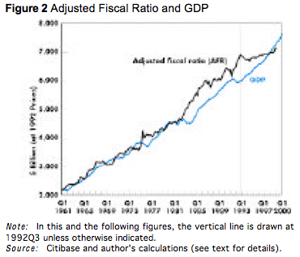
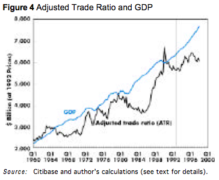

```{r setup, include=FALSE}
knitr::opts_chunk$set(echo = FALSE)
library(plotrix)
library(pdfetch)
library(networkD3)
library(knitr)
```

# Welcome!

- Welcome and thanks for taking this module
- intended for students who have a good mathematical background and wish to expand their knowledge of advanced economic modelling, data calibration, and model simulation
- On completion of the module, the students will have a deep understanding of various modelling practices in economics and their relevance in policy making, as well as an in-depth knowledge of data calibration and model simulation

## Aims

- introduce students to pluralistic modelling practices such as Stock-Flow-Consistent (SFC) modelling, Kaleckian growth models, Post-Keynesian and Marxian models of growth and debt cycles and Agent-Based Modeling (ABM)
- equip students with the necessary knowledge to build and simulate different small and medium scale models.
- equip students with an in-depth knowledge of data analysis and model simulation.
- introduce students to the basics of system dynamics approach


## Logistics

- Module leader: Antoine Godin
	* Office: HH0009
	* Office hours: Tue, Wed, Thu: 11-12
	* Email: a.godin@kingston.ac.uk
- Lecturer: Devrim Yilmaz
	* Office: HH1011
	* Office hours: Mon: 4.00-5.30 & Tue: 2.30-4.00
	* Email: s.yilmaz@kingston.ac.uk

## Outline

- Week 1-2: Understanding National Accounts
- Week 3-5: Stock-Flow Consistent Modelling
- Week 6-8: Heterodox Theories of Distribution and Growth
- Week 9-12: Growth and Debt Cycles
- Week 13-14: Modelling System Dynamics
- Week 15–16: Introduction to Agent - Based Modelling
- Week 17–22: Stock-Flow Consistent Agent Based Models

## Assessment

- Thre research projects (Nov. 16, Feb. 15 and Apr. 7), each 25%
- One class test (Jan. 11), 25%

## Week 1 to 5: SFC modelling and national accounts

- Get you fluent in ESA2010 language: what does S11, P3, MIO_NAC or EL stand for?
- Know your way around Eurostat and ONS database
- Introduction to R and relevant packages (pdfetch, PKSFC)
- Build and calibrate medium scale SFC model

# National Accounts and Stock-Flow Consistent Modelling

- SFC models are based on a set of different tables that are more or less connected to real data and national accounts.
- Balance Sheets
- Transaction Flow Matrix
- Full Integration Matrix
- References: Godley and Lavoie Ch. 2, Caverzasi and Godin (2015), Eurostat and ONS Blue book


## Stock-Flow Accounting

- Started with Copeland (1949) and his Social Accounting for moneyflows, picked up by Denizet (1969) and many others...
- Highlights the importance to incorporate monetary and financial processes into national accounts such as NIPA.
- Very close to Keynes's idea to integrate financial and income accounting.
- Idea is to be able to answer Copeland questions:
	* when total purchases of our national product increase, where does the money come from to finance them?
	* when purchases of our national product decline, what becomes of the money that is not spent?

## Balance Sheets

- Balance sheets display the assets, liabilities and the balancing item net worth.
- Most of you are familiar with basic balance sheets such as the households balance sheet for the households at the end of 2015 in the United Kingdom (source eurostat).

```{r, echo=FALSE,message=FALSE}
names<-c("F2","F3","F4","F5","F6","F7","BF90")
sec="S14_S15"
F_BS_raw = pdfetch_EUROSTAT("nasa_10_f_bs", UNIT="MIO_NAC", CO_NCO="CO", NA_ITEM=names, SECTOR=sec, TIME="2014", GEO="UK")
F_BS<-as.data.frame(F_BS_raw)
NFA_BS_raw = pdfetch_EUROSTAT("nama_10_nfa_bs", UNIT="CP_MNAC", SECTOR=sec, GEO="UK", ASSET10=c("N1N","N2N"))
NFA_BS<-as.data.frame(NFA_BS_raw)
balancesheet<-matrix(0,ncol=2,nrow=9,dimnames = list(c("Produced non-financial asset","Non-produced non financial assets","Currency and deposits","Securities other than shares","Loans","Shares and other equity","Insurance technical reserves","Other accounts receivable/payable","Net Worth"),c("Assets","Liabilities")))
counter<-1
for(name in c("N1N","N2N")){
	colnamea<-paste("A.CP_MNAC",sec,name,"UK",sep=".")
	balancesheet[counter,1]<-NFA_BS[18,colnamea]
	counter<-counter+1
}
for(name in names[1:6]){
	colnamea<-paste("A.MIO_NAC.CO",sec,"ASS",name,"UK",sep=".")
	colnamel<-paste("A.MIO_NAC.CO",sec,"LIAB",name,"UK",sep=".")
	balancesheet[counter,1]<-F_BS[20,colnamea]
	balancesheet[counter,2]<-F_BS[20,colnamel]
	counter<-counter+1
}
balancesheet[9,2]<-F_BS[20,paste("A.MIO_NAC.CO",sec,"LIAB.BF90.UK",sep=".")]+NFA_BS[18,paste("A.CP_MNAC",sec,"N1N.UK",sep=".")]+NFA_BS[18,paste("A.CP_MNAC",sec,"N2N.UK",sep=".")]
kable(balancesheet)
```


## Non-financial corporations

```{r, echo=FALSE,message=FALSE}
names<-c("F2","F3","F4","F5","F6","F7","BF90")
sec="S11"
F_BS_raw = pdfetch_EUROSTAT("nasa_10_f_bs", UNIT="MIO_NAC", CO_NCO="CO", NA_ITEM=names, SECTOR=sec, TIME="2014", GEO="UK")
F_BS<-as.data.frame(F_BS_raw)
NFA_BS_raw = pdfetch_EUROSTAT("nama_10_nfa_bs", UNIT="CP_MNAC", SECTOR=sec, GEO="UK", ASSET10=c("N1N","N2N"))
NFA_BS<-as.data.frame(NFA_BS_raw)
balancesheet<-matrix(0,ncol=2,nrow=9,dimnames = list(c("Produced non-financial asset","Non-produced non financial assets","Currency and deposits","Securities other than shares","Loans","Shares and other equity","Insurance technical reserves","Other accounts receivable/payable","Net Worth"),c("Assets","Liabilities")))
counter<-1
for(name in c("N1N","N2N")){
	colnamea<-paste("A.CP_MNAC",sec,name,"UK",sep=".")
	balancesheet[counter,1]<-NFA_BS[18,colnamea]
	counter<-counter+1
}
for(name in names[1:6]){
	colnamea<-paste("A.MIO_NAC.CO",sec,"ASS",name,"UK",sep=".")
	colnamel<-paste("A.MIO_NAC.CO",sec,"LIAB",name,"UK",sep=".")
	balancesheet[counter,1]<-F_BS[20,colnamea]
	balancesheet[counter,2]<-F_BS[20,colnamel]
	counter<-counter+1
}
balancesheet[9,2]<-F_BS[20,paste("A.MIO_NAC.CO",sec,"LIAB.BF90.UK",sep=".")]+NFA_BS[18,paste("A.CP_MNAC",sec,"N1N.UK",sep=".")]+NFA_BS[18,paste("A.CP_MNAC",sec,"N2N.UK",sep=".")]
kable(balancesheet)
```

- note negative net worth due to market value of equity
- capital stock are at market value (replacement cost) and not historical costs

## Financial corporations

```{r, echo=FALSE,message=FALSE}
names<-c("F2","F3","F4","F5","F6","F7","BF90")
sec="S12"
F_BS_raw = pdfetch_EUROSTAT("nasa_10_f_bs", UNIT="MIO_NAC", CO_NCO="CO", NA_ITEM=names, SECTOR=sec, TIME="2014", GEO="UK")
F_BS<-as.data.frame(F_BS_raw)
NFA_BS_raw = pdfetch_EUROSTAT("nama_10_nfa_bs", UNIT="CP_MNAC", SECTOR=sec, GEO="UK", ASSET10=c("N1N","N2N"))
NFA_BS<-as.data.frame(NFA_BS_raw)
balancesheet<-matrix(0,ncol=2,nrow=9,dimnames = list(c("Produced non-financial asset","Non-produced non financial assets","Currency and deposits","Securities other than shares","Loans","Shares and other equity","Insurance technical reserves","Other accounts receivable/payable","Net Worth"),c("Assets","Liabilities")))
counter<-1
for(name in c("N1N","N2N")){
	colnamea<-paste("A.CP_MNAC",sec,name,"UK",sep=".")
	balancesheet[counter,1]<-NFA_BS[18,colnamea]
	counter<-counter+1
}
for(name in names[1:6]){
	colnamea<-paste("A.MIO_NAC.CO",sec,"ASS",name,"UK",sep=".")
	colnamel<-paste("A.MIO_NAC.CO",sec,"LIAB",name,"UK",sep=".")
	balancesheet[counter,1]<-F_BS[20,colnamea]
	balancesheet[counter,2]<-F_BS[20,colnamel]
	counter<-counter+1
}
balancesheet[9,2]<-F_BS[20,paste("A.MIO_NAC.CO",sec,"LIAB.BF90.UK",sep=".")]+NFA_BS[18,paste("A.CP_MNAC",sec,"N1N.UK",sep=".")]+NFA_BS[18,paste("A.CP_MNAC",sec,"N2N.UK",sep=".")]
kable(balancesheet)
```

- Central Banks are in the financial corporations

## Goverment

```{r, echo=FALSE,message=FALSE}
names<-c("F2","F3","F4","F5","F6","F7","BF90")
sec="S11"
F_BS_raw = pdfetch_EUROSTAT("nasa_10_f_bs", UNIT="MIO_NAC", CO_NCO="CO", NA_ITEM=names, SECTOR=sec, TIME="2014", GEO="UK")
F_BS<-as.data.frame(F_BS_raw)
NFA_BS_raw = pdfetch_EUROSTAT("nama_10_nfa_bs", UNIT="CP_MNAC", SECTOR=sec, GEO="UK", ASSET10=c("N1N","N2N"))
NFA_BS<-as.data.frame(NFA_BS_raw)
balancesheet<-matrix(0,ncol=2,nrow=9,dimnames = list(c("Produced non-financial asset","Non-produced non financial assets","Currency and deposits","Securities other than shares","Loans","Shares and other equity","Insurance technical reserves","Other accounts receivable/payable","Net Worth"),c("Assets","Liabilities")))
counter<-1
for(name in c("N1N","N2N")){
	colnamea<-paste("A.CP_MNAC",sec,name,"UK",sep=".")
	balancesheet[counter,1]<-NFA_BS[18,colnamea]
	counter<-counter+1
}
for(name in names[1:6]){
	colnamea<-paste("A.MIO_NAC.CO",sec,"ASS",name,"UK",sep=".")
	colnamel<-paste("A.MIO_NAC.CO",sec,"LIAB",name,"UK",sep=".")
	balancesheet[counter,1]<-F_BS[20,colnamea]
	balancesheet[counter,2]<-F_BS[20,colnamel]
	counter<-counter+1
}
balancesheet[9,2]<-F_BS[20,paste("A.MIO_NAC.CO",sec,"LIAB.BF90.UK",sep=".")]+NFA_BS[18,paste("A.CP_MNAC",sec,"N1N.UK",sep=".")]+NFA_BS[18,paste("A.CP_MNAC",sec,"N2N.UK",sep=".")]
kable(balancesheet)
```

## Balance Sheets in SFC

- When you are constructing the balance sheets of your model, you should first consider which assets you will include in your model.
	* Real assets: Capital stock, housing etc.
	* Financial assets/liabilities: cash, deposits, bills, bonds, loans, equities, derivatives, bank reserves, monetary gold, SDR etc.
- These assets will contain the economic wealth accumulated by economic agents. So your balance sheet matrix must contain the assets you decide to include in your model, and it should clearly identify which sectors in your economy hold which assets and which liabilities. As usual, the difference between assets and liabilities will yield net worth.

## Example

| |HHs|Firms|Gov.|Banks|C. B.| Sum|
|:------:|:------:|:------:|:------:|:------:|:------:|:------:|:------:|
|Capital|+Kh|+Kf| | ||	+K|
|Money|+Hh| | |+Hb |-H|	0|
|Bills|+Bh| |-Bs|+Bb|+Bcb|0|
|Loans|-Lh|-Lf |+L|0|0|0|
|Equities|+Ef|-Ef |0|0|0|0|
|Equities|+Eb|0 |-Eb|0|0|0|
|Net worth|-NWh|-NWf |-NWb|-NWg|0|-K|
|Sum|0|0|0|0|0|0|


## Sectorial accounts (from Eurostat)

- Sector accounts record every transaction between sector and the change in financial assets and liabilities. 
- Transactions are grouped in categories having a distinct economic meaning. Each non-financial transaction is recorded as an increase in the "resources" of a sector and an increase in the "uses" of another.
- Shown in a sequence of accounts, each of which covers a specific economic process.
- Two main categories: current accounts and accumulation accounts
	* *Current accounts* record transactions that do not involve the purchase or sale of financial or non-financial assets. Final balancing item is saving
	* *Accumulation accounts* record net acquisition of non-financial and financial assets, and the net incurrence of liabilities. Also show other changes in balance sheets, such as revaluations and write-offs of bad debts
	* The accumulation accounts explain all the changes in the (non-financial and financial) balance sheets
	
## Example for households in the UK in 2014

```{r,message=FALSE}

# Selecting the flows
names<-c("B5G","D5","D61","D62","D7","D8","B6G","P3","B8G","P5G","D9","NP","B9")

# Obtaining the data
EZdata_raw = pdfetch_EUROSTAT("nasa_10_nf_tr", UNIT="CP_MNAC",NA_ITEM=names, GEO="EU28",
                              SECTOR=c("S14_S15"), TIME="2014")

# Transforming the data into a data.frame
EZdata<-as.data.frame(EZdata_raw)

# Automatic procedure to remove the non-interesting bit of the colnames
coln<-colnames(EZdata)
newcoln<-c()
HHdata<-c()

for(i in 1:length(coln)){
  name<-coln[i]
  tname<-strsplit(name,"\\.")[[1]]
  newname<-paste(tname[3:4],collapse=".")
  # If the column contains only NA, remove it from the dataset
  if(!is.na(EZdata[16,i])){
    newcoln<-c(newcoln,newname) 
    HHdata<-c(HHdata,EZdata[16,i])
  }
}

# Creating a new dataset with only values 2014
HHdata<-as.data.frame(t(HHdata))
colnames(HHdata)<-newcoln

# Creating the aggregates
HHdata_1<-as.data.frame(c(HHdata$PAID.B5G,-HHdata$PAID.D5,-HHdata$PAID.D61+HHdata$RECV.D61,
                          +HHdata$RECV.D62-HHdata$PAID.D62,-HHdata$PAID.D7+HHdata$RECV.D7,paste(HHdata$PAID.B6G,"]"),-HHdata$PAID.P3,-HHdata$PAID.D8+HHdata$RECV.D8,paste(HHdata$PAID.B8G,"]"),-HHdata$PAID.P5G,-HHdata$PAID.D9+HHdata$RECV.D9,
                          -HHdata$PAID.NP,HHdata$PAID.B9))
colnames(HHdata_1)<-"Households"
rownames(HHdata_1)<-c("Total Income","Taxes","Social Contributions","Social Benefits",
                      "Other transfers","[Gross Disposable Income","Consumption","Adjustments in Pensions","[Gross Savings","Gross Capital Formation","Capital Transfer",
                      "Net Non-Produced NF Assets","Net Lending Position")
kable(HHdata_1)
```


## Transaction flow matrix

1. The transactions flow matrix consists of three separate parts.
	- On the top rows of the matrix, you will have output expressed as expenditures, which by definition is given by $Y = C + I + G (+ X - M)$
	- The matrix should clearly identify the consumption and investment by the sectors in your model.

2. The second part of the transactions flow matrix outlines output using an income approach.
	- Depending on how disaggregated your model is and how many assets you have included in your model, this part may include various sources of income for your sectors 


## Assume a closed economy,

- Households work for firms in exchange for wages, consume, invest in housing and hold cash, equities of firms and banks, government bills and deposits as financial assets. Government taxes households, firms and banks and spends, and issues bills to finance its deficit.
- Firms employ households to produce goods and invest in productive capital stock. They use undistributed profits to finance investment and borrow from banks/issue new equity to finance any shortfall.
-Banks lend to households and firms, hold bills, accept deposits from households and distribute part of their profits to households. They do not invest in tangible capital.
- Central bank holds government bills and transfers its profits to the government


##Example of Transaction Flow Matrix
				


## Transaction flow matrix, part 2

- Once you have identified the first two parts of the transactions flow matrix, you have a complete picture of income sources and expenditures of each sector in your model.
- Naturally, the difference between income and expenditures yields the savings of each sector, which are then allocated to real and financial assets to accumulate wealth.
- The last part of the full flow matrix shows which assets and liabilities these savings/dissavings have been channelled to.
- In order to ensure that each column adds up to zero, we have to record the changes in assets/liabilities in a non-intuitive way and record changes in assets with a (-) sign and change in liabilities with a (+) sign.
- Therefore, each column now shows

*Income – Expenditures – Change in assets/liabilities =0*

## Full integration matrix

- Once you have written down the transactions flow matrix, you can move to derive the full integration matrix, which simply shows the changes in net worth of your sectors between the beginning of the period and the end of the period.
- In order to do so, you use the bottom part of the transactions flow matrix with opposite signs in order to make sure increases in assets lead to an increase in net worth and increases in liabilities lead to a decrease in net worth. (Do not forget to add change in tangible capital)
- One further consideration is the change in the value of some stocks of assets between the beginning of the period and the end of the period.
- In order to capture this, you will need to add rows for the assets whose values are subject to such change.
- The last row now becomes the net worth of each sector at the end of the period.

## Example of Full Integration Matrix
				


# pdfetch: getting data automatically

- Fetch Economic and Financial Time Series Data from Public Sources
- Package developped by Abiel Reinhart
- We will be using the `pdfetch_EUROSTAT` function

```{r,eval=FALSE}
?pdfetch_EUROSTAT
```

## Example 1: Net lending per sector, UK

```{r,message=FALSE,echo=T,eval=T}
# Specifying the name of the flows of interests
names<-c("B9")
# Downloading the data by specifying the various filters
UKdata_raw = pdfetch_EUROSTAT(flowRef = "nasa_10_nf_tr", 
		UNIT="CP_MNAC",NA_ITEM=names, GEO="UK", DIRECT="PAID",
		SECTOR=c("S11","S12","S13","S14_S15","S2"))
# Transforming the obtained data into a data.frame
UKdata<-as.data.frame(UKdata_raw)
# Setting readable names
colnames(UKdata)<-c("NFC","FC","Govt","HH","RoW")

# Matricial plot
matplot(1995:2015,UKdata,lwd=2,type="l",lty=1,
		ylab="",xlab="",col=2:6)
# Adding the horizontal line
abline(h=0,col=1)
# Adding a grid
grid()
# Adding a legend
legend("bottomleft",col=c(2:6),lwd=2,lty=1,legend=c("NFC",
		"FC","Govt","HH","RoW"),bty='n')
```


## Example 2: Household income statement from 2014

```{r,message=FALSE,echo=T,eval=T}
# Selecting the flows
names<-c("B5G","D5","D61","D62","D7","D8","B6G","P3","B8G"
			,"P5G","D9","NP","B9")
# Obtaining the data
EZdata_raw = pdfetch_EUROSTAT("nasa_10_nf_tr", 
			UNIT="CP_MNAC",NA_ITEM=names, GEO="EU28",
			SECTOR=c("S14_S15"), TIME="2014")
# Transforming the data into a data.frame
EZdata<-as.data.frame(EZdata_raw)

# Automatic procedure to remove the non-interesting bit
# of the colnames
coln<-colnames(EZdata)
newcoln<-c()
HHdata<-c()
for(i in 1:length(coln)){
  name<-coln[i]
  tname<-strsplit(name,"\\.")[[1]]
  newname<-paste(tname[3:4],collapse=".")
# If the column contains only NA, remove it from dataset
  if(!is.na(EZdata[16,i])){
    newcoln<-c(newcoln,newname) 
    HHdata<-c(HHdata,EZdata[16,i])
  }
}

# Creating a new dataset with only values 2014
HHdata<-as.data.frame(t(HHdata))
colnames(HHdata)<-newcoln
# Creating the aggregates
HHdata_1<-as.data.frame(c(HHdata$PAID.B5G,-HHdata$PAID.D5,
			-HHdata$PAID.D61+HHdata$RECV.D61,
			+HHdata$RECV.D62-HHdata$PAID.D62,
			-HHdata$PAID.D7+HHdata$RECV.D7,HHdata$PAID.B6G))
colnames(HHdata_1)<-"Households"
rownames(HHdata_1)<-c("Total Income","Taxes"
		,"Social Contributions","Social Benefits",
		"Other transfers","Gross Disposable Income")
kable(HHdata_1)

HHdata_2<-as.data.frame(c(HHdata$PAID.B6G,-HHdata$PAID.P3,
		-HHdata$PAID.D8+HHdata$RECV.D8,HHdata$PAID.B8G))
colnames(HHdata_2)<-"2014"
rownames(HHdata_2)<-c("Gross Disposable Income",
	"Consumption","Adjustments in Pensions","Gross Savings")
kable(HHdata_2)

HHdata_3<-as.data.frame(c(HHdata$PAID.B8G,-HHdata$PAID.P5G
		,-HHdata$PAID.D9+HHdata$RECV.D9,-HHdata$PAID.NP,
		HHdata$PAID.B9))

colnames(HHdata_3)<-"2014"
rownames(HHdata_3)<-c("Gross Savings",
		"Gross Capital Formation","Capital Transfer",
		"Net Non-Produced NF Assets","Net Lending Position")
kable(HHdata_3)
```


# PKSFC package

- Allowing to simulate SFC models in an open source environment}
* Still preliminary
* Only one numerical solver: Gauss-Seidel algorithm (Kinsella and O'Shea 2010)
* github.com/s120/pksfc
- Technical aspect
* R package
* EViews translator
* Read equation files
* Build model from console
* Visualisation/Design tools and helpers

## Installing the dependent libraries and the package

You need to install all the required libraries This is for traditional libraries
```{r, eval=F, echo=T}
install.packages("expm")
install.packages("igraph")
```

For non-conventional libraries, such as the one need to visualize Direct Acyclical Graphs (DAG), you need to do the following
```{r,eval=F, echo=T}
source("http://bioconductor.org/biocLite.R")
biocLite("Rgraphviz")
```

Finally you can then download the PKSFC package from github and install it locally
```{r, eval=F,echo=T}
install.packages("path/PKSFC_1.5.tar.gz", repos = NULL, 
								 type="source")
```


## Testing

Now we're ready to load the package:
```{r, echo=T}
library(PKSFC)
```

1. Load SIM (download SIM.txt from Github)
```{r,echo=T}
sim<-sfc.model("SIM.txt",modelName="SIMplest model 
		from chapter 3 of Godley and Lavoie (2007)")
```

2. Simulate the model
```{r,echo=T}
datasim<-simulate(sim)
```

3. replicate figure 3.2 of page 73.
```{r, width=10,echo=T,eval=T}
matplot(sim$time,datasim$baseline[,c("Yd","C")],type="l", 
	xlab="", ylab="",lwd=2,lty=c(2,3))
lines(sim$time,vector(length=length(sim$time))
	+datasim$baseline["2010","C"], lwd=2)
legend(x=1970,y=50,lwd=2, legend=c("Disposable Income",
	"Consumption","Steady State"),lty=c(2,3,1), bty="n")
``` 

## How does it work?

- The package parses a text file containing the equations
- It generates an internal representation of the model
- It checks the internal consistency of the model, the calibration
- Allows to simulate the model using a linear solver, the Gauss-Seidel Algorithm

## Source code of SIM

```{r, eval=FALSE,echo=T}
#1. EQUATIONS
C = C
G = G
T = T
N = N
Yd = W*N - T
T = theta*W*N
C = alpha1*Yd + alpha2*H_h(-1)
H = H(-1) + G - T
H_h = H_h(-1) + Yd - C
Y = C + G
N = Y/W
#2. PARAMETERS
alpha1=0.6
alpha2=0.4
theta=0.2
#EXOGENOUS
G=20
W=1
#INITIAL VALUES
H=0
H_h=0
#3. Timeline
timeline 1945 2010
```

## A few important points regarding the model source code:

- The first line of the code should be a comment line (starting with `#`)
- The file should not contain any empty lines.
- You should avoid naming your variables with reserved names in R such as 'in' or 'max'.
- There should be only one equation per line.
- There should be only one variable on the left hand side of the equation.
- You can use R functions such as min, max, or logical operators such as > or <=. In the case the logical operatur returns true, the numeric value will be one. Thus `(100>10)` will return `1`.
- The lag operator is represented by `(-x)` where `x` is the lag.
- You can add as many comments, using the `#` character at the begining of the line. Each comment exactly above an equation will be considered as the description of the equation and will be stored in the internal representation of the sfc model object.

## Internal representation

```{r, echo=T}
print(sim)
```

## Output data structure

- Output is a list of matrix where each element of the list are a scenario
	* baseline
	* scenario_i

```{r}
kable(datasim$baseline)
```

## The Gauss Seidel Algorithm

- Principle:
Solving $Ax=b,\, A\in\mathbb{R}^{n\times n},\, b\in \mathbb{R}^n$ via an iterative algorithm, where each iteration can be represented by $L x^{k+1} = b-Ux^{k},\, A=L+U$. Where $L$ is lower triangular and $U$ is upper triangular. 

- Pseudo-code:
1. Select initial values $x^0$
2. While $k<maxIter$ \& $\delta < tolValue$
a. For each $i=1,...,n$: $$x_i^{k+1}=\frac{1}{a_{ii}}\left( b_i-\sum^{i-1}_{j=1}a_{ij} x_j^{k+1}-\sum_{j=i+1}^n a_{ij}x_j^k\right)$$
b. Compute $\delta$: $$\delta = \frac{x^{k+1}-x^k}{x^k}$$

# System of (in)dependent equations
> See Fenell et. al (2016) 

- The Gauss-Seidel has to be used only in the case of system of dependent equations
- In other case, we only need to find order in which each variable is computed and simply compute the new value in each period
- This order is the "logical causal order" of the model and can be visualised using Direct (A)Cyclical Graphs 

## Direct Acyclic graphs

```{r, message=F, echo=T}
simex<-sfc.model("SIMEX.txt",modelName="SIMplest model with expectation")
layout(matrix(c(1,2),1,2))
plot.dag(sim,main="SIM" )
plot.dag(simex,main="SIMEX" )
```

- Aside from the mathematical implication that a system of equation represent, it also has an economic meaning:
* the economy represented by SIM will adjust in one period to any shock applied to government spending. 
* for SIMEX it is not the case because consumption depend on expected disposable income which is equal to previous period disposable income. 
* in this case, the economy represented by SIMEX will adjust slowly to a shock applied to government spending, via the stocks (and particularly the buffer stock)

## In the case of a more complex model - Chapter 6 

- We can generate the plots that allow us to delve into the actual structure of the system.
- Nodes that do not form a cycle are green while nodes that form a cycle in the system are pink.
- The Gauss-Seidel needs to be applied only for the cycles

````{r}
ch6 <- sfc.model("ch6.txt",modelName="Chapter6_openmodel")
graphs = generate.DAG.collapse( adjacency = ch6$matrix )
par(mfrow = c(1,3))
# first plot the orgianl grpah
plot_graph_hierarchy( graphs$orginal_graph, main = "orginal graph" )
# plot hte nodes that form the strongly connected compoent
plot_graph_hierarchy( graphs$SCC_graph, main = "SCC nodes" )
# plot the result ing DAG when we take the condensation of the graph
plot_graph_hierarchy( graphs$DAG, main = "resulting DAG" )
````


## Systems of dependent vs independent equations

```{r,width=10,echo=T}
#Doing the simulations
datasimex<-simulate(simex)
init = datasimex$baseline[66,]
simex<-sfc.addScenario(simex,"G",25,1960,2010,init)
datasimex<-simulate(simex)
datasim<-simulate(sim)
init = datasim$baseline[66,]
sim<-sfc.addScenario(sim,"G",25,1960,2010,init)
datasim<-simulate(sim)

#Plotting it all
layout(matrix(c(1,2),1,2))
matplot(sim$time,datasim$scenario_1[,c("H","C","Yd")],
	lty=1:3,type="l",xlab="",ylab="",main="SIM")
legend(x=1944,y=130,legend=c("Wealth","Consumption",
	"Disposable Income"), lty=1:3,bty="n")
matplot(simex$time,datasimex$scenario_1[,c("H","C","Yd",
	"Yd_e")],lty=1:4,type="l",xlab="",ylab="",main="SIMEX")
legend(x=1944,y=130,legend=c("Wealth","Consumption","Disposable Income",
   "Expecetd Disposable Income"),lty=1:4,bty="n")
```

## Computational implications

Let's see how much time it takes to run sim:
```{r, echo=T}
ptm <- proc.time()
data1<-simulate(sim)
print(paste("Elapsed time is ",proc.time()[3]-ptm[3],
						"seconds"))
```

Now lets play with some of the parameters of the simulate function:

1. tolValue
```{r, echo=T}
ptm <- proc.time()
data2<-simulate(sim,tolValue = 1e-3)
print(paste("Elapsed time is ",proc.time()[3]-ptm[3],"seconds"))
```

2. maxIter
```{r,echo=T}
ptm <- proc.time()
data3<-simulate(sim, maxIter=10)
print(paste("Elapsed time is ",proc.time()[3]-ptm[3],"seconds"))
```


## Observing the results of the three simulations
```{r,echo=T}
kable(round(t(cbind(data1$baseline[c(1,2,20,40,66),c("Y")],
		data2$baseline[c(1,2,20,40,66),c("Y")],
		data3$baseline[c(1,2,20,40,66),c("Y")])),digits=3))
```


## Block Gauss-Seidel
The order of equations matters, if first compute variables that do not depend on current period, this speeds the process. Define blocks of equation independent from the others.
```{r,echo=T}
print(simex$blocks)
```


## Simulation of SIMEX
```{r,echo=T}
ptm <- proc.time()
dataex<-simulate(simex,tolValue = 1e-10)
print(paste("Elapsed time is ",proc.time()[3]-ptm[3]
						,"seconds"))
```


## Results for SIMEX
```{r,echo=T}
kable(round(t(dataex$baseline[c(1,2,20,40,66),c("G","Y",
	"T","Yd","Yd_e","C","H","H_h")]),digits=3))
```

## Output data structure
- Output is a list of matrix where each element of the list are a scenario
* baseline
* scenario_i
- In the result matrix, there is a column indicating the number of iteration in the Gauss-Seidel algorithm per block of equations per period

```{r, echo=T, eval=T}
kable(dataex$baseline)
```


## Checking the number of iteractions for SIM


```{r, echo=T}
kable(round(t(cbind(
	data1$baseline[c(1,2,20,40,66),c("iter block 1")],
	data2$baseline[c(1,2,20,40,66),c("iter block 1")],
	data3$baseline[c(1,2,20,40,66),c("iter block 1")]
	)),digits=3))
```

## Checking the number of iteractions for simex, no simulate parameters
```{r, echo=T}
kable(round(t(dataex$baseline[c(1,2,20,40,66),
	c("iter block 1","iter block 2","iter block 3",
	"iter block 4","iter block 5","iter block 6",
	"iter block 7")]),digits=3))
```

# Financial Imbalances

## Godley's seven unsustainable processes @Godley:1999c

1. Written in 1999 when everything was fine for the US economy. Clinton: ``There are no limits to the world we can create, together, in the century to come."
2. Calling for political intervention and expansionary fiscal policies: ``\emph{The view taken here, which is built into the Keynesian model later deployed, is that the government's fiscal operations, through their impact on disposable income and expenditure, play a crucial role in determining the level and growth rate of total demand and output.}''
3. Highlighting seven unsustainable processes: ``*(1) the fall in private saving into ever deeper negative territory, (2) the rise in the flow of net lending to the private sector, (3) the rise in the growth rate of the real money stock, (4) the rise in asset prices at a rate that far exceeds the growth of profits (or of GDP), (5) the rise in the budget surplus, (6) the rise in the current account deficit, (7) the increase in the United States's net foreign indebtedness relative to GDP.*"

## Stock-flow norms

> @Turnovsky:1977 p.3 and @Godley:2007, p.13

There are *intrinsic dynamics*, that reflect ‘the dynamic behaviour stemming from certain logical relationships which constrain the system; specifically the relationships between stocks and flows’

- *Standards*: (private or public) debt to GDP, capacity utilisation, unemployment rate, etc...
- *Adjusted fiscal ratio*: $\theta=\frac{T}{Y}$ is the average tax rate, then the fiscal ratio $\frac{G}{\theta}$ is equal to $Y$ when $G=T$, adjusted for inflation.
- *Adjusted Trade Ratio*: $\mu=\frac{M}{Y}$ is the average propensity to import, then the trade ratio $\frac{X}{\mu}$ is equal to GDP when $X=M$, adjusted for inflation.
- *Combined Fiscal and Trade Ratio*: $\frac{G+X}{\theta+\mu}$ is equal to GDP when balanced budget and trade balance.

##Unsustainable processes @Godley:1999c





- "Given unchanged fiscal policy and accepting the consensus forecast for growth in the rest of the world, continued expansion of the U.S. economy requires that private expenditure continues to rise relative to income. [...] The growth in net lending to the private sector and the growth in the growth rate of the real money supply cannot continue for an extended period." (p. 5)
- "It will become necessary both to relax the fiscal stance and to increase exports relative to imports [but] it will be difficult to get the timing right." (p. 9)
- He then simulates "whatever fiscal expansion plus (effective) dollar devaluation is necessary to generate the growth of output assumed in the CBO projections (growth just enough to keep unemployment close to its present low level) and an improving balance of payments. Specifically, it was necessary to raise total general government outlays [...] in stages by about 16 percent - corresponding to about \$400 billion per annum at current prices - compared with what the CBO is at present projecting." (p. 10)


# References
